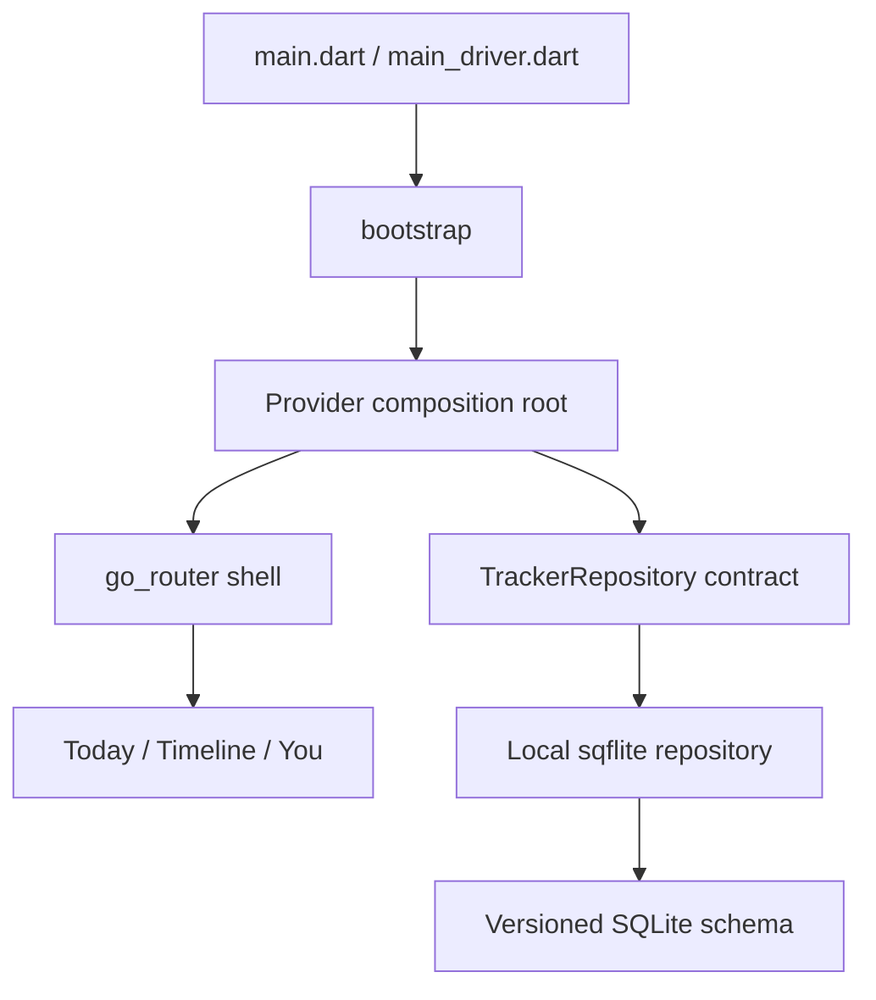

# Project foundation

LastDone is an offline-first Flutter app for remembering recurring parts of everyday life. Phase 0 establishes the app shell, design language, local database boundary, and placeholder destinations. Product workflows, onboarding, tracker CRUD, notifications, sync, and production Dun artwork remain intentionally unimplemented.

## Architecture

The project uses pragmatic feature-first MVVM. Views render state, ChangeNotifier ViewModels will own presentation behavior as features grow, repositories expose domain models, and SQLite stays behind a repository contract. Provider supplies dependencies from the composition root; go_router owns navigation outside screen widgets.

SQLite is behind a contract so UI and future business logic do not depend on a storage vendor; the local implementation can later be replaced or tested independently.

The driver entrypoint is separate because `enableFlutterDriverExtension` is development automation support and must never be part of a release entrypoint.

Run the production app with `fvm flutter run -t lib/main.dart` and development automation with `fvm flutter drive --target=test_driver/app.dart` when a driver test is added. Analyze with `fvm flutter analyze`; format with `fvm dart format .`.

Important files: [`lib/app/bootstrap.dart`](../../lib/app/bootstrap.dart), [`lib/app/app_router.dart`](../../lib/app/app_router.dart), [`lib/app/app_theme.dart`](../../lib/app/app_theme.dart), [`lib/core/database/database_bootstrap.dart`](../../lib/core/database/database_bootstrap.dart), and [`lib/features/trackers/domain/tracker.dart`](../../lib/features/trackers/domain/tracker.dart).
