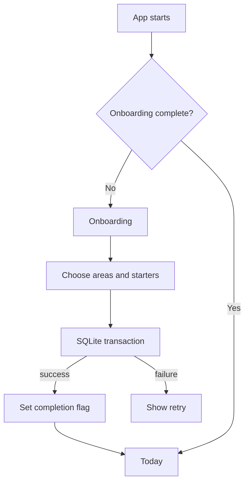

# Phase 1: Onboarding

LastDone’s first launch is a short, local onboarding journey:

1. Welcome introduces LastDone and Dun.
2. Life areas help the user choose what deserves remembering.
3. Starter trackers provide useful defaults that can be selected, deselected, or lightly edited.
4. Reminder education records whether the user wants future reminders, without asking for device permission yet.
5. Completion saves the selected trackers and opens Today.

## State and persistence

`OnboardingViewModel` in `lib/features/onboarding/presentation/onboarding_view_model.dart` owns the current step, areas, starter edits, reminder intent, loading state, and recoverable errors. Widgets forward intent to it and remain declarative.

`OnboardingStatusStore` in `lib/features/onboarding/data/onboarding_status_store.dart` is the small typed boundary around `shared_preferences`. It stores only the completion flag and reminder intent. The `TrackerRepository` boundary writes real tracker records to SQLite.

Starter IDs are stable catalogue IDs such as `home-bedsheets`. `LocalTrackerRepository.insertStarterTrackers` inserts the whole selection inside one SQLite transaction and ignores an existing ID. This makes retries safe and prevents duplicate rows. The ViewModel marks onboarding complete only after that database operation succeeds; a failure leaves completion unset and shows a retry state.

## Routing and testing

`lib/app/bootstrap.dart` reads the local completion flag before creating the app. `lib/app/app_router.dart` starts first launches at `/onboarding` and returning launches at `/today`. Completion uses `go('/today')`, replacing the onboarding location so system back cannot reopen it.

Tests can inject `MemoryOnboardingStatusStore`, a fixed clock, and an in-memory SQLite database. This makes first-launch, returning-user, retry, and idempotency behavior testable without editing production preferences.

Notification permission is intentionally deferred. This phase records reminder intent so a future reminders feature can ask at the right moment, but it does not request iOS or Android permission.

Intentionally unimplemented: Today dashboard behavior, the full tracker editor, reminder scheduling, device notification permission, and custom tracker creation. Limited starter editing exists only to make the initial setup useful.

Important files:

- `lib/features/onboarding/presentation/onboarding_screen.dart`
- `lib/features/onboarding/presentation/onboarding_view_model.dart`
- `lib/features/onboarding/domain/onboarding_models.dart`
- `lib/features/onboarding/data/onboarding_status_store.dart`
- `lib/features/trackers/data/local_tracker_repository.dart`
- `test/features/onboarding/onboarding_view_model_test.dart`
- `test/features/trackers/data/local_tracker_repository_test.dart`
