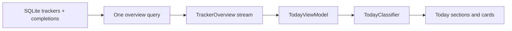

# Phase 2: Today dashboard

Today is a read-only overview of the active trackers stored by EverDun. The screen does not read SQLite itself. `LocalTrackerRepository` performs one overview query that returns each tracker and its latest completion, then publishes an immutable list through `TrackerOverviewRepository`.

## Status and grouping

`TodayClassifier` in `lib/features/today/domain/today_overview.dart` owns the pure classification rules. It normalizes dates to local calendar midnights and uses the injected clock supplied by `lib/core/time/app_clock.dart`.

- A tracker without a completion is `notStarted`, never overdue.
- A tracker with no cadence is `unscheduled` and has no fabricated due date.
- A completed recurring tracker advances by calendar days, weeks, months, or years.
- Monthly dates clamp to the final valid day of the target month. Yearly dates use the same month arithmetic, so leap-day dates resolve safely in non-leap years.
- A due date before today is `overdue`; today is `dueToday`; the next seven calendar days are `dueSoon`; later dates are `upcoming`.
- A completion within the previous seven calendar days is `recentlyDone` when the tracker is not currently due.

The sections are mutually exclusive. Needs attention contains overdue, due today, and not-started trackers. Coming up contains due-soon, upcoming, and unscheduled trackers without recent completion. Recently done contains recent completions that are not due. Each section has a stable sort order, and every tracker is assigned to exactly one section.

The current schema has no archive column, so existing tracker rows are treated as active. This phase does not perform a destructive migration. The `RepeatRule.unscheduled` value is compatible with the existing non-null text column.

## ViewModel and UI states

`TodayViewModel` in `lib/features/today/presentation/today_view_model.dart` subscribes once to the repository overview stream, cancels that subscription on disposal, and guards updates after disposal. It owns loading, content, empty, and error states, the current calendar date, greeting, and summary copy. It observes app lifecycle resume and refreshes when the calendar date changes.

`lib/features/trackers/presentation/today_screen.dart` renders only non-empty sections. It includes calm built-in transitions, a loading placeholder, an empty state that opens the existing Create placeholder, and a friendly retry state. Cards use stable category icons and explicit text status so colour is not the only signal. Tracker details, completion, undo, timeline history, reminders, scoring, and creation remain intentionally unimplemented.

Date arithmetic treats stored timestamps as instants and converts them to the device’s local calendar before comparison. This means a day follows the user’s local timezone; daylight-saving changes do not turn a calendar boundary into an elapsed-24-hour rule.

## Manual testing

David can manually test this phase by completing onboarding, checking that the starter rows appear once in Today, and verifying each section with data at different dates. Also check a tracker with no completion, an unscheduled tracker, a recent completion, an overdue cadence, and an all-clear set. Try light and dark themes, relaunching the app, a compact iPhone width, large text, scrolling, card taps, pull-to-refresh, and the empty/error presentation where safely reproducible.

Important files:

- `lib/features/today/domain/today_overview.dart`
- `lib/features/today/presentation/today_view_model.dart`
- `lib/features/trackers/data/local_tracker_repository.dart`
- `lib/features/trackers/domain/tracker_repository.dart`
- `lib/features/trackers/presentation/today_screen.dart`
- `lib/app/app_router.dart`
