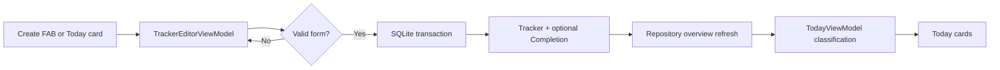

# Phase 3: Tracker creation and editing

Phase 3 replaces the Create placeholder with one reusable tracker editor. The
same bottom sheet is used for creating a tracker and editing its metadata. A
tracker can be scheduled with a calendar-based repeat rule or left unscheduled
for things that happen whenever they are ready.

## The create and edit journeys

The Create FAB is available from Today, Timeline, and You. It opens the editor
with a name, category, icon, colour, starting point, and schedule.
The form validates locally and keeps its values when persistence fails. On a
successful create, the sheet closes and Today receives the refreshed overview.

Tapping a Today card opens the same editor in edit mode. Edit mode shows the
latest completion as context, but deliberately does not edit or rewrite
completion history. Phase 4 can introduce explicit tracker details and
completion actions.

Creation offers three starting points: **Not yet** creates no completion,
**Today** creates one completion for today, and **Earlier date** creates one
completion for a selected past date or today. A scheduled tracker can
independently receive a first due date while its starting point is Not yet; a
future date is never presented as a last completion.

Editing has no starting-point controls. It shows a compact read-only summary
such as “Last handled today”, “Last handled Sep 12”, or “No completions yet”,
with navigation to the existing details/history view. Completion history is
never rewritten or duplicated from the editor.

## State and storage

`TrackerEditorViewModel` owns form state, validation, dirty-state detection,
loading, and recoverable errors. `TrackerEditorSheet` only renders that state
and forwards user intent. Scheduling is explicit: **No schedule** means “Log it
whenever it happens.” **Repeats** reveals a positive interval, day/week/month/
year unit, first due date when applicable, and reminder controls. The editor
uses shared singular/plural count helpers, so cadence copy says “Every day”,
“Every 2 days”, or “Every 3 months”; “Every 1 time” is not a valid state.

`LocalTrackerRepository.createTracker` writes the tracker and its optional
initial completion in one SQLite transaction. This means a chosen initial date
cannot leave an orphan completion or a tracker without its required data. User
tracker IDs are generated from the injected clock, while the repository
transaction is the persistence boundary that prevents partial writes.

Categories and colours are stored as stable keys or enum names. Tracker icons
use the existing text column through `TrackerIcons`: legacy keys remain valid
and resolve to curated native Unicode emojis, while new choices use an
`emoji:<value>` key. Full emoji values are preserved, including modifiers and
variation selectors; no database migration or code-unit truncation is needed.
System emoji fonts can vary slightly across platforms, but meaningful semantic
labels remain stable. This keeps saved onboarding rows and older trackers
compatible with the editor. `updateTracker` changes only the tracker row, so
editing cadence or metadata does not silently rewrite history. The repository
publishes a refreshed overview after each successful mutation, allowing Today
to update without polling.

The editor’s icon selector is a compact horizontally scrolling strip of
comfortable tap targets, and the colour selector is a single-row palette with
32-point swatches and a high-contrast check ring. Starting point and Schedule
use compact segmented controls. Conditional first-due, repeat, and reminder
controls are progressively disclosed so the sheet remains a focused creation
flow instead of a tall settings page.

## Navigation and layout

The shell in `lib/app/app_router.dart` gives Today, Timeline, and You equal
navigation destinations. The Create FAB uses the Scaffold's end-floating
position and SafeArea support, leaving navigation labels and the iPhone home
indicator unobscured. Today cards are padded below the FAB and open the editor
instead of using a dead tap.

The editor is a scrollable, keyboard-safe modal sheet. Controls have semantic
selected states and at least 44-point targets. Built-in animated containers
respect `MediaQuery.disableAnimations`; no animation dependency was added.

## Manual test flow

1. Open Create from each of the three shell tabs and confirm the FAB does not
   cover navigation or content.
2. Create Not yet, Today, and Earlier date trackers. Try a future date, blank
   name, long name, and invalid interval.
3. Confirm a newly created tracker appears on Today immediately and is grouped
   according to its due date.
4. Tap a Today card, edit each metadata field, and confirm completion history
   remains unchanged. Dismiss a dirty form and verify the confirmation.
5. Relaunch the app, then check light/dark mode, keyboard behaviour, compact
   widths, large text, and scrolling.

## Intentionally deferred

Done-today actions, undo, full completion history, archive/delete/restore,
reminder scheduling, notification permission, Life Rhythm scoring, cloud sync,
and backend services remain out of scope. The empty Today action now opens the
same editor, but the broader tracker-details experience remains Phase 4 work.

Important references:

- `lib/features/trackers/presentation/tracker_editor_view_model.dart`
- `lib/features/trackers/presentation/tracker_editor_sheet.dart`
- `lib/features/trackers/data/local_tracker_repository.dart`
- `lib/features/trackers/domain/tracker.dart`
- `lib/app/app_router.dart`
