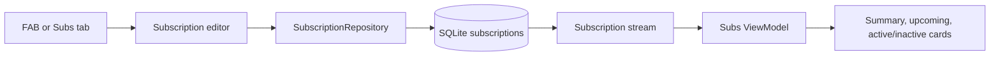

# Phase 5: Subscriptions

Subscriptions have a dedicated persistent tab because recurring charges are a
different kind of remembering from everyday trackers. The four shell
destinations are Today, Subs, Timeline, and You. The FAB remains at the
lower-right: it opens the relevant editor on Today or Subs, and a compact
Tracker/Subscription chooser on Timeline and You.

## Data and persistence

`Subscription` is user-owned data with a stable ID, optional catalog ID, name,
category, logo key, amount in integer minor units, ISO currency, billing
frequency, next-charge date, active state, and timestamps. Formatted money is
never persisted. `SubscriptionRepository` keeps this contract separate from
SQLite, while `LocalTrackerRepository` remains the app’s current local data
composition point.

Database version 3 adds only a `subscriptions` table and its active/date index.
The migration is forward-only and leaves tracker and completion tables intact.
Create and update operations are transactional and publish immutable ordered
lists through the subscription stream. Active subscriptions contribute to the
summary and upcoming charges; inactive subscriptions remain visible in a
secondary section but contribute to neither.

## Money and calendar rules

Supported currencies are GHS, USD, GBP, EUR, CAD, NGN, ZAR, and KES. Amounts
are validated to positive values with at most two decimal places and stored as
minor units. Monthly estimates stay grouped by currency: weekly is amount ×
52 ÷ 12, monthly is amount, quarterly is amount ÷ 3, six-month is amount ÷ 6,
and yearly is amount ÷ 12. Final integer division deliberately rounds to the
nearest minor unit; currencies are never converted.

The saved charge date is treated as a calendar anchor. `nextChargeOnOrAfter`
advances it using local calendar dates and clamps month ends, including dates
anchored on the 29th–31st and February 29 in non-leap years. The dashboard
derives a current upcoming occurrence without rewriting the stored value.
The injected `AppClock` supplies “today,” avoiding widget-level
`DateTime.now()` calls and timezone shifts.

## Catalog and logos

The code-owned catalog in
`lib/features/subscriptions/domain/subscription_catalog.dart` includes
streaming, music, sports, AI, gaming, cloud/productivity, news/reading, and
fitness services from the Phase 5 brief, plus a Custom subscription path.
Catalog IDs remain separate from editable display names. Search filters names
and aliases within the selected category.

No logo assets are bundled in this phase because no verified reusable official
source was available. The centralized fallback in
`subscription_editor_sheet.dart` uses a category colour and the first letter,
with an accessible semantic label. The sourcing policy and manifest are in
`docs/learning/05-brand-assets.md`; runtime logo URLs are not used.

## Completion-flow polish

The completion detail screen now awaits the animation controller’s completion
future before returning to Today. Reduced motion still navigates promptly
after persistence. Today clears any existing SnackBar before showing the
five-second “Freshly handled” Undo SnackBar, and Undo dismisses it immediately
before deleting only the exact completion ID.

## Manual testing

1. Check all four tabs preserve state and that the context-aware FAB opens the
   correct flow or chooser without covering navigation.
2. Create catalog services from Streaming, AI, gaming, and sports; search by
   name; create a custom subscription; and inspect fallback logos.
3. Test positive, zero, decimal, and very large amounts, all frequencies,
   currencies, and date anchors on the 29th, 30th, 31st, and February 29.
4. Verify immediate dashboard refresh, ordering, per-currency estimates,
   editing with stable identity, active/inactive behavior, dirty dismissal,
   relaunch persistence, compact layout, large text, themes, and semantics.
5. Complete trackers and verify the full celebration precedes Today, reduced
   motion skips decorative delay, Undo expires after five seconds, Undo is
   exact, and successive completion SnackBars replace rather than stack.

## Deferred

Notifications, reminders, bank/card integrations, email discovery, exchange
rates, payment history, invoice/payment actions, trials, family splitting,
receipt scanning, analytics beyond monthly estimates, sync, authentication,
backend services, tracker archive/delete, full Timeline, tests, and future
subscription enhancements remain deferred.

Important references:

- `lib/features/subscriptions/domain/subscription.dart`
- `lib/features/subscriptions/domain/subscription_catalog.dart`
- `lib/features/subscriptions/domain/subscription_repository.dart`
- `lib/features/subscriptions/presentation/subscription_editor_sheet.dart`
- `lib/features/subscriptions/presentation/subscriptions_screen.dart`
- `lib/features/trackers/data/local_tracker_repository.dart`
- `lib/core/database/database_bootstrap.dart`
- `lib/app/app_router.dart`
