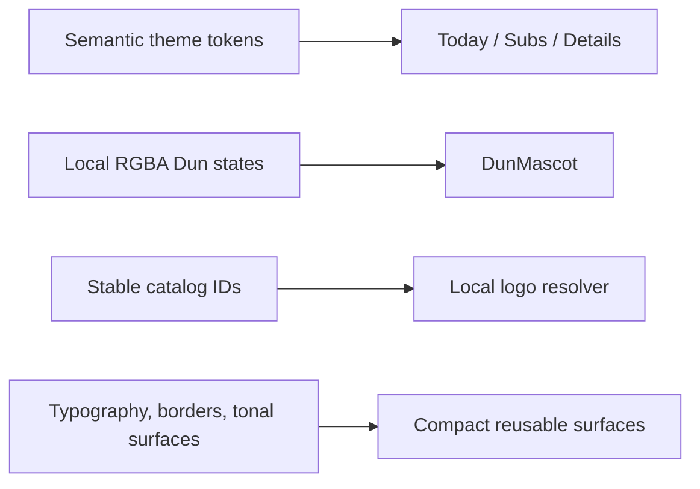

# Visual refresh

The visual refresh keeps LastDone’s approved behavior intact while making the
interface calmer, more compact, and more recognisable. Warm parchment and
near-white surfaces are paired with deep forest primary colour in light mode;
dark mode uses charcoal-green surfaces, muted mint selection, and visible
grey-green supporting text. Borders are hairline tinted borders, and elevation
is reserved for floating or modal elements.

Typography remains Bricolage Grotesque for display and Manrope for controls,
body copy, and metadata. The shared text theme now uses a smaller hierarchy so
screen titles, section headings, and cards leave more room for the user’s data.
Cards use compact padding, modest radii, tonal fills, and little or no shadow.

Today’s header and insight banner are compact. Tracker rows show the name and
one useful cadence/status line; detail pages remain the place for history and
full context. Subs uses a compact estimate, a lightweight upcoming preview,
and a denser all-subscriptions list so the same information does not compete
at two equal visual weights. The four navigation destinations use a consistent
Lucide line-icon vocabulary, with the existing tonal capsule and selected
colour providing the active state.

## Dun and service marks

`DunMascot` in `lib/core/widgets/dun_view.dart` is the single presentation
component for the supplied idle, subscriptions, and celebrating PNG states.
The optimized images are RGBA files with genuine transparency and a maximum
dimension of 800 pixels. The subscriptions state has a slow breathing motion;
all decorative motion pauses when reduced motion is enabled. The completion
flow still waits for persistence and the full success animation before
navigating, and the supplied celebrating render provides the visual accent.

Subscription catalog marks are resolved by stable catalog ID through
`SubscriptionLogo` and `simple_icons`. Missing mappings intentionally fall
back to a category-coloured rounded tile with an initial. Marks are local
package glyphs, never remote URLs; trademark ownership remains with each
service and their use does not imply endorsement. See
`docs/learning/05-brand-assets.md` for the source policy.

## Manual review

David can manually check both themes, four-tab contrast, FAB clearance, large
text, compact widths, mascot transparency, mapped and fallback service marks,
Today card density, subscription summaries, tracker details, and the complete
completion/undo timing. Reduced-motion settings should show the same saved
outcome without decorative movement.

No schema, classification, recurrence, money, completion, undo, routing
meaning, or business rules changed in this refresh. A fully rigged mascot or
Rive animation remains a possible future enhancement, as do additional mascot
states.
