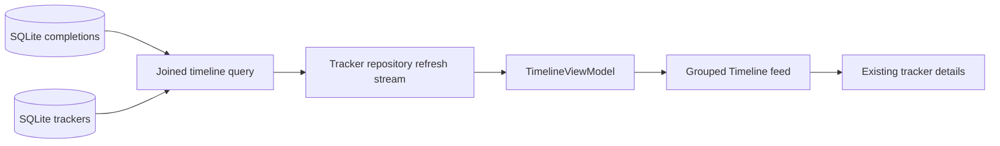

# Completion Timeline

Timeline is a read-only chronological view of genuine `Completion` records.
It does not turn subscription charge dates, tracker creation, or other
activity into fake events. The tracker repository remains the owner of this
data.

`TimelineEntry` in `lib/features/timeline/domain/timeline.dart` is the small
presentation read model. `LocalTrackerRepository.queryTimeline` performs one
parameterized left-joined query against completions and trackers, returning
current tracker metadata, followed by a bounded monthly count query. A left
join gives a safe “Removed tracker” entry if a completion ever outlives its
tracker. Because the existing Completion table has no metadata snapshot,
historical entries intentionally reflect the tracker’s current name, icon,
category, colour, and cadence.

The feed uses keyset pagination ordered by `completed_at DESC, id DESC`.
The last timestamp and completion ID form the cursor, while a page-size-plus-
one query determines whether more entries exist. Search and category filters
are SQL parameters, never concatenated user input. Completion, undo, and
tracker-edit mutations publish one repository invalidation stream, so the
Timeline refreshes without polling or duplicate subscriptions. A queued
refresh and request version protect newer filter or mutation state from stale
responses.

`TimelineViewModel` owns loading, refresh, pagination, filters, grouping, and
date lifecycle. It groups timestamps by local calendar date and refreshes on
resume when the injected clock crosses midnight. The screen uses platform
localizations for times and older date labels, with Today and Yesterday as
friendly local-calendar labels. Stored completion timestamps remain
authoritative; no UTC conversion is used to decide a local day.

The monthly summary is a factual count for the injected clock’s current local
month. Subscription records are deliberately excluded because an expected
charge is not proof that a payment occurred. Editing or deleting history,
subscription payment events, streaks, export, and cloud sync remain deferred.

The feed uses compact tonal rows with stable completion-ID keys, semantic
labels, a restrained connector, and existing tracker-detail routing. Empty,
filtered-empty, initial-error, and pagination-error states remain distinct.
Built-in transitions become immediate when reduced motion is enabled.

## Manual review

Complete trackers, undo one, edit metadata, switch tabs, search, filter by
category, scroll beyond one page, relaunch, and compare Today/Yesterday labels
around a date change. Also review empty and error states, light/dark contrast,
large text, compact widths, scrolling, semantics, and reduced motion.
## History row rendering follow-up

Manual testing showed a real completion count and a visible date group header,
but no completion card beneath the header. The repository result, ViewModel
entries, and date grouping were therefore present; the failure was in the old
presentation layout. Each row placed an `Expanded` timeline-rail child inside
the vertically unbounded nested `Column` used by the page `ListView`. That
flex layout could fail before the row received a usable size.

History now flattens each non-empty group into one ordered presentation
collection: a date header followed by its completion rows. A single
`CustomScrollView` renders the page, and one stable `SliverList` renders that
flattened history collection. Group headers use date keys and completion rows
use completion-ID keys. Rows render directly without opacity, size, or
entrance-animation wrappers. The rail marker no longer depends on an
unbounded flex child, and each row includes its time and category (or
“Removed tracker” metadata).

The existing joined completion query was not changed because the count,
entries, and group header proved that persisted completion data already
existed. The rendering path continues to include active, archived, and
missing-tracker completion metadata; missing trackers remain navigable through
the existing details route where applicable. Planner projections continue to
use their separate rendering path and are never inserted into History.
