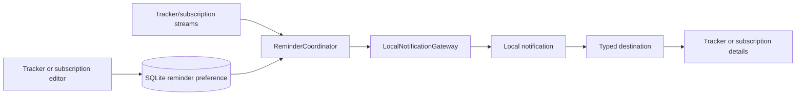

# Phase 7: reminders and notifications

EverDun reminders are optional, local nudges for scheduled trackers and active subscriptions. They are deliberately separate from the user’s reminder preference and the device’s notification permission: a person can express intent even when the operating system has blocked delivery.

## Journey and permission

The tracker and subscription editors contain a compact Gentle reminder section. Scheduled trackers and active subscriptions can choose a lead time and local wall-clock time. Unscheduled trackers explain that a schedule is required; inactive subscriptions retain their preference but do not deliver it.

The first enabled reminder opens an in-app explanation. Only “Allow reminders” calls the platform permission API. “Not now” saves the preference without prompting. You > Reminders shows permission, enabled counts, a settings link, and a direct-send test action. No request happens during onboarding or startup.

## Stored preference and scheduling

`lib/features/reminders/domain/reminder.dart` contains typed target and lead-time values. `reminder_preferences` is added by database migration 4 in `lib/core/database/database_bootstrap.dart`. The row has one stable integer notification ID per target, a unique target pair, local time, lead days, and an optional occurrence key. IDs are allocated transactionally from the persisted sequence space; they never use Dart `hashCode`.

`ReminderCoordinator` (`lib/features/reminders/application/reminder_coordinator.dart`) reads the existing tracker overview and subscription streams, then calculates at most one future candidate per enabled target. Tracker dates use `TodayClassifier.nextDueDateFor`; subscription dates use the existing `nextChargeOnOrAfter` calculator. Preferred lead times fall back to the due/charge date when the lead moment has passed. Overdue occurrences are not nagged repeatedly.

Candidates are sorted nearest first and at most 60 EverDun requests are scheduled, leaving headroom under iOS’s 64 pending-request limit. Requests are one-shot, not repeating, so monthly 29/30/31 clamping and leap-day behavior remain owned by EverDun’s calendar-aware rules. Preferences beyond the window remain enabled and are reconsidered on later reconciliation. A fired recurrence may wait until the app resumes before its next one-shot request is created.

`LocalNotificationGateway` (`lib/features/reminders/data/notification_gateway.dart`) owns plugin calls, permission inspection, local IANA timezone setup, scheduling, cancellation, pending requests, test delivery, and typed response payloads. Payloads contain only a target type and stable ID. App-layer routing opens `/trackers/:id` or `/subscriptions/:id` after the router is ready; malformed payloads are ignored. Subscription details are read-only apart from the existing editor action.

## Timezones, privacy, and errors

Preferences store local hour and minute. The gateway initializes `timezone` and obtains the device IANA identifier from `flutter_timezone`; conversion to a zoned time occurs only at the scheduling boundary. Initialization and scheduling errors are contained so they cannot prevent app startup or roll back saved tracker/subscription data. On resume, the coordinator retries initialization and reconciliation, which also handles device timezone changes through the gateway’s timezone setup.

Notification copy is short and private. Amounts and notes never appear on the lock screen, and the test notification uses generic copy. Android uses inexact idle-capable scheduling, stable channels, a checkmark status icon, and boot rescheduling. It does not request exact alarms, full-screen intents, critical alerts, or background services. iOS uses plugin initialization with permission requests disabled until the editor flow asks.

## Manual testing

1. Confirm launch does not prompt for permission.
2. Enable a scheduled tracker reminder, choose each lead time and a local time, and check the preview.
3. Confirm unscheduled trackers cannot enable delivery.
4. Enable a subscription reminder, then edit its frequency/date and verify the next reminder changes.
5. Complete and undo a tracker and verify reconciliation is retried.
6. Disable or deactivate targets and confirm delivery is cancelled; reactivate and verify it returns.
7. Use You > Reminders to inspect permission/counts, open settings, and send the direct test notification.
8. Test foreground, background, terminated launch, tracker routing, subscription routing, and malformed payload safety on iOS.
9. Repeat with light/dark mode, large text, compact width, reduced motion, relaunch, and a timezone change where practical.

Android runtime validation is deferred. When it is available, check Android 13 permission, stable channels, inexact timing, boot rescheduling, and the monochrome status icon.

## Deferred limitations

There are no push notifications, notification actions, exact alarms, payment history, repeated overdue nags, cloud scheduling, or notification-service extensions. Only one occurrence per target is scheduled at a time and only the nearest 60 candidates are kept in the platform queue. Notification delivery depends on platform permission and operating-system power policies.
