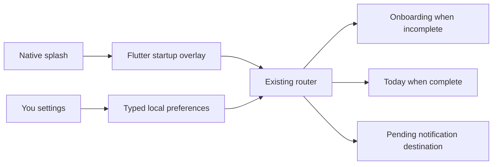

# Phase 8: profile, branding, and startup polish

## Local profile settings

The You screen is a local-first profile rather than an account. `ProfileSettingsStore` in `lib/features/profile/domain/profile_settings.dart` defines the typed contract, while `SharedPreferencesProfileSettingsStore` keeps the small values in SharedPreferences. The display name is trimmed and limited by the form, and an absent name falls back to a friendly generic greeting.

`AppPreferencesController` (`lib/app/app_preferences_controller.dart`) loads the theme and default subscription currency once at app startup. Theme changes update `MaterialApp` immediately and persist as System, Light, or Dark. The currency is only read as the initial value for new subscription editors; existing subscription rows are never converted or rewritten.

## Real activity summary

`ProfileStatisticsRepository` is implemented by the existing `LocalTrackerRepository`. It uses typed aggregate SQLite queries for active trackers, current-month completions, all completions, active subscriptions, and per-currency monthly estimates. A refresh stream is invalidated by tracker/completion/subscription mutations, so the profile summary follows the same repository-owned data lifecycle as Today and Subs. No streak, score, exchange rate, or achievement is invented.

## Branding and platform assets

The approved masters are stored as `assets/branding/everdun_app_icon.png` and `assets/branding/everdun_adaptive_foreground.png`. They remain square PNGs: the app icon is opaque RGB and the adaptive foreground is RGBA with real transparency. The generated iOS icons use the opaque master. Android uses the opaque legacy icon, the transparent adaptive foreground, and `#2F6B4F` as the adaptive background. `android/app/src/main/res/drawable/dun_notification.png` provides the bundled Dun artwork as a large notification icon; the existing white checkmark drawable remains the monochrome status-bar icon.

`flutter_launcher_icons` and `flutter_native_splash` are development-time generators, configured in `pubspec.yaml`. No runtime image URL or downloaded brand asset is used. Trademark artwork remains the approved Dun artwork and is not presented as a partnership or endorsement.

## Native splash and Flutter startup

The generated native splash is static and fast, with warm parchment in light mode, charcoal-green in dark mode, and the transparent Dun foreground. `StartupBrandingOverlay` (`lib/app/startup_branding_overlay.dart`) then presents a short Flutter-owned fade/scale handoff over the already selected route. Database and notification initialization can continue beneath it. Reduced motion uses a short fade without decorative movement. Because the overlay ignores pointers and does not replace the router, onboarding guards, returning-user routing, and notification destinations retain their existing priority. A future approved `.riv` asset could replace the presentation implementation; Rive is intentionally not a dependency today.

## Manual testing

1. Edit, clear, and relaunch with a display name; confirm Today’s greeting is personalized without becoming oversized.
2. Compare the activity totals with Today, Timeline, and Subs after completion, Undo, tracker edits, and subscription changes.
3. Change System/Light/Dark and relaunch. Change default currency and confirm only newly created subscriptions use it.
4. Open Reminders from You and confirm permission status, enabled counts, settings, and test delivery still work.
5. Open About, version/build information, privacy copy, and the Flutter license page.
6. Inspect iOS launcher/notification identity and Android legacy/adaptive launcher icons, status icon, and Dun large notification icon.
7. Cold-launch in both themes and observe the static native splash followed by the short Dun handoff.
8. Test reduced motion, first-launch onboarding, returning-user routing, and notification-launch routing without duplicate navigation.
9. Check compact widths, large text, scrolling, semantic labels, and dark-mode contrast.

The generated platform files should be regenerated only when the approved masters or generator configuration changes. Runtime simulator and Android validation remain manual/release-readiness work for this phase.
