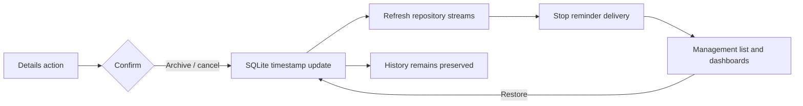

# Archive and cancellation management

LastDone keeps completion and lifecycle management separate. Completing a tracker records a real event; it does not hide the tracker. Archiving is an intentional, reversible action for trackers, while subscriptions use the product language “cancelled” and “restored”.

## Tracker lifecycle

Trackers store an optional `archivedAt` timestamp. Active queries require it to be null, while the archive query orders records by the most recent archive first. Archive and restore are idempotent updates in the forward-only database migration that adds `trackers.archived_at`. No tracker or completion row is deleted, so Timeline can continue to show historical completions with the tracker’s current metadata.

The details screen confirms before archiving. It explains that Today and reminders change while history remains. The reminder coordinator also observes the active overview stream, so archiving removes the tracker from reminder candidates; restoring makes it eligible for reconciliation again.

### Popup-menu route safety

The archive confirmation exposed a Flutter Navigator assertion: `!_debugLocked`. The failing call chain was `_archive → showLastDoneDialog → showDialog → Navigator.push`, invoked while the popup menu route was still dismissing. The same audit found the equivalent risk for subscription cancellation and restoration actions launched from detail menus.

That frame-deferral approach was insufficient in practice because the popup route lifecycle remained unsafe for a follow-up modal push. Destructive actions are therefore intentionally not available from overflow menus. Tracker Details and Subscription Details now expose stable “Manage” sections in the page route itself. Their direct buttons open confirmation dialogs without competing with a closing menu. Edit remains a stable app-bar button; restoration remains available from stable management rows or page content.

## Subscription lifecycle

Subscriptions use an optional `cancelledAt` timestamp alongside the existing active flag. Cancellation is a database update, not deletion: amount, currency, cadence, service identity, and reminder preference remain intact. Active subscription queries and monthly totals exclude inactive rows. The cancelled-subscriptions screen restores a saved record without fabricating a payment or changing its billing configuration.

The migration adding `subscriptions.cancelled_at` is forward-only and preserves existing data. Reminder cancellation is attempted after the database update. If platform cleanup fails, the item remains cancelled and the UI explains that the data was saved; the coordinator can safely reconcile later.

## Refresh and safety

The local repository publishes its existing overview, subscription, timeline, and profile refresh streams after lifecycle changes. Stable IDs and conditional updates make repeated archive, restore, cancel, and restore requests harmless. The custom confirmation and success/error dialogs keep persistence and reminder failures understandable without exposing SQL or plugin errors.

The debug banner is disabled on the normal application root, while assertions and development tooling remain enabled. Permanent deletion is intentionally deferred so users cannot accidentally lose history in this phase.

The archive-column migration also uses typed `PRAGMA table_info` introspection.
This recovers from a partially applied development upgrade without dropping,
rebuilding, or resetting tracker data.

